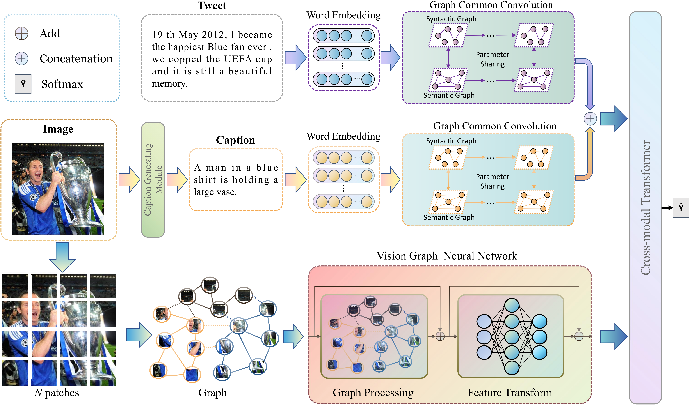

# CoolNet: Cross-modal fine-grained alignment and fusion network for multimodal aspect-based sentiment analysis

This repository contains the source code and datasets associated with the paper titled "Cross-modal fine-grained alignment and fusion network for multimodal aspect-based sentiment analysis."

  

## Data

- Step 1：Download each tweet's associated images via this link [Google Drive](https://drive.google.com/file/d/1PpvvncnQkgDNeBMKVgG2zFYuRhbL873g/view), and then put the associated images into folders "./datasets/twitter2015_images/" and "./datasets/twitter2017_images/";
- Step 2: Download each finetune file via this link [Google Drive](https://drive.google.com/drive/folders/1nRHti6jdcrZOkh6PaqnpgdllAxjUuMCO?usp=sharing), and then put the associaled finetune model files into folder "./finetune/roberta_15/final/" and "./finetune/roberta_17/final/"
- Step 3: Download the pre-trained roberta-base-cased and put the pre-trained roberta model under the folder "./model/roberta-base-cased/"
- Step 4: Download the vig_s_80.6.pth checkpoints [VIG-Backbone](https://github.com/huawei-noah/Efficient-AI-Backbones/releases/tag/vig) and put it under the folder "./"

## Requirement
conda env create > CoolNet.yaml

### Training for CoolNet
- python solve_final.py

###  References
@article{xiao2023cross,
  title={Cross-modal fine-grained alignment and fusion network for multimodal aspect-based sentiment analysis},
  author={Xiao, Luwei and Wu, Xingjiao and Yang, Shuwen and Xu, Junjie and Zhou, Jie and He, Liang},
  journal={Information Processing \& Management},
  volume={60},
  number={6},
  pages={103508},
  year={2023},
  publisher={Elsevier}
}

### Acknowledgements
- Using these two datasets means you have read and accepted the copyrights set by Twitter and dataset providers.
- Most of the codes are based on the codes provided by huggingface: https://github.com/huggingface/transformers.
